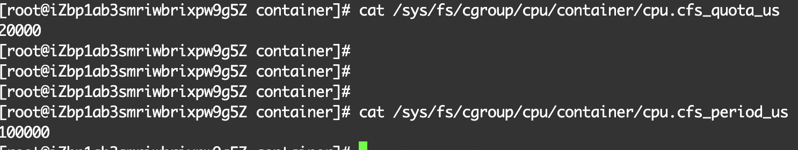
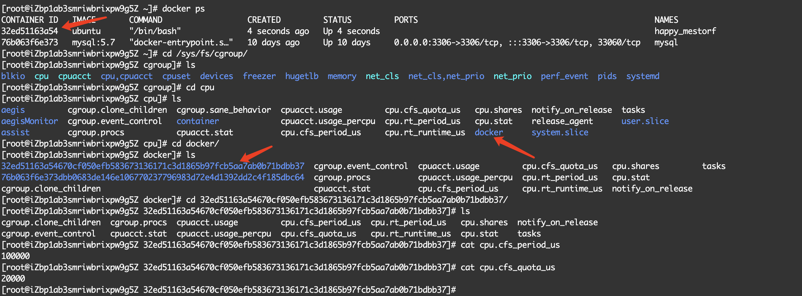
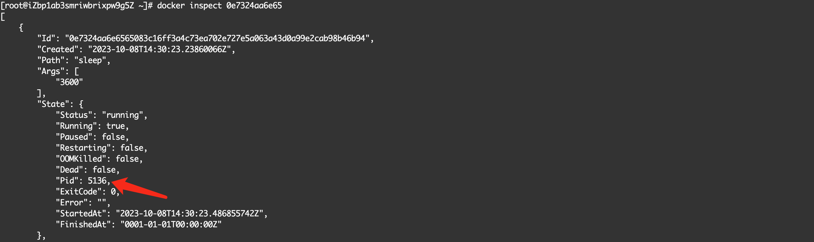
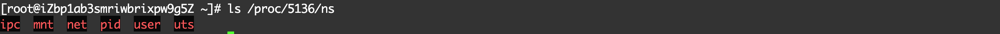
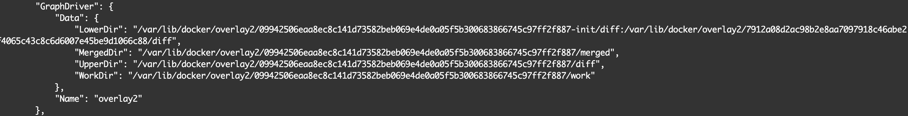
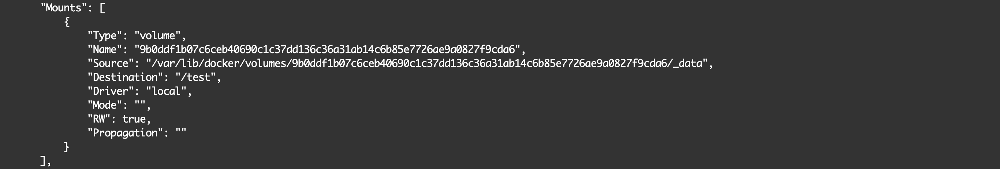
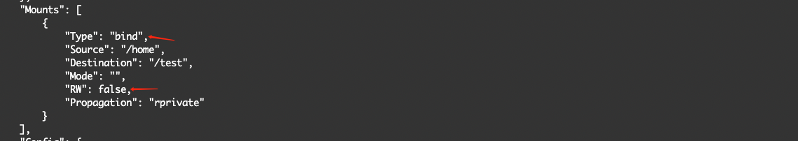
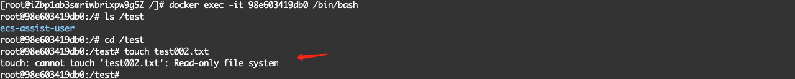
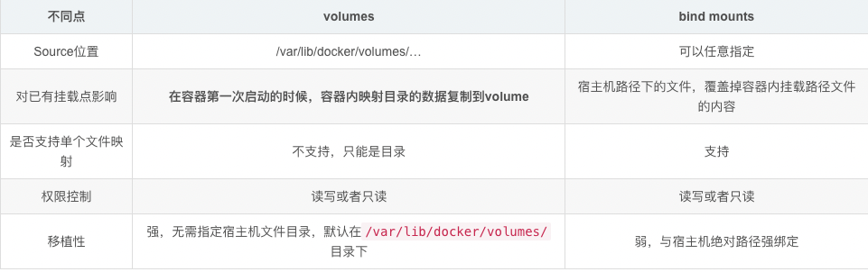

# 基础

## 进程

Docker项目通过容器镜像，解决了应用打包这个根本性难题

对于Docker等大多数Linux容器来说，Cgroups技术是用来设置资源限制的主要手段，Namespace是用来修改进程视图的主要方法。

Linux操作系统提供了PID、Mount、Network等Namespace。

Mount Namespace作用是让被隔离进程只看到当前Namespace里的挂载信息；Network Namespace用于让被隔离进程看到当前Namespace里的网络设备和配置。

Docker容器，实际上是在创建容器进程时，指定了这个进程所需要启用的一组Namespace参数。所以说容器是一种特殊的进程。对于宿主机来说，这些被隔离的进程跟其他进程并没有太大区别。

Docker项目帮助用户启动的，还是原来的进程，只不过在创建这些进程时，Docker为它们加上了各种各样的Namespace参数。

虚拟机的工作原理：通过硬件虚拟化功能，模拟出了运行一个操作系统需要的各种硬件，然后在这些虚拟的硬件上安装了一个新的操作系统，即Guest OS。

虚拟机与Docker对比：

1. 使用虚拟化技术作为应用沙盒，就必须要由Hypervisor来负责创建虚拟机，这个虚拟机是真实存在的，并且它里面必须运行一个完整的Guest OS才能执行用户的应用程序。这就不可避免的带来了额外的资源消耗和占用
2. 用户应用运行在虚拟机里，它对宿主机操作系统的调用就不可避免的要经过虚拟化软件的拦截，带来性能损耗，容器化后的用户应用就不存在这个问题。

## 隔离与限制

基于Namespace的隔离机制，相比于虚拟机，隔离得不彻底。

1. 多个容器间共享宿主机的操作系统内核。比如在Windows宿主机上运行Linux容器，是行不通的。
2. Linux内核中，很多资源和对象是不能被Namespace化的，比如时间。

Cgroups全称为Linux Control Group。它的作用是，限制一个进程组能够使用的资源上限，包括CPU、内存、网络带宽等。

在Linux中，Cgroups给用户暴露出来的操作接口是文件系统，即它以文件和目录的方式组织在操作系统的 `/sys/fs/cgroup`路径下

``/sys/fs/cgroup``下有很多诸如cpu、memory这样的子目录，叫子系统，这些都是可以被cgroups进行限制的资源种类。而在子系统对应的资源种类下，可以看到该类资源可以被限制的方法。

cfs_period和cfs_quota，配合使用，可以用来限制进程在长度为cfs_period的一段时间内，只能被分配到总量为cfs_quota的CPU时间。



如图，container目录为在cpu子系统中新创建的目录，container目录中自动生成该子系统对应的资源限制文件。

cfs_period：100ms；
cfs_quota：20ms；

它意味着在每 100 ms 的时间里，被该控制组限制的进程只能使用 20 ms 的 CPU 时间，也就是说这个进程只能使用到 20% 的 CPU 带宽。

对于Docker等Linux容器项目来说，它们只需要在每个子系统（如cpu目录）下面，为每个容器创建一个控制组（即创建一个新目录，如上面的container）,然后在启动容器进程之后，把这个进程PID写入到对应控制组的tasks文件中即可。

```bash
# 启动docker容器
docker run -it --cpu-period=100000 --cpu-quota=20000 ubuntu /bin/bash
```



## 容器镜像

Mount Namespace修改的，是容器进程对文件系统“挂载点”的认知。这就意味着，只有在“挂载”这个操作发生之后，进程的视图才会
被改变。而在此之前，新创建的容器会直接继承宿主机的各个挂载点。

Mount Namespace跟其他Namespace的使用略有不同的地方：它对容器进程视图的修改，一定是伴随着挂载操作（mount）才能生效。

如何做到，每当新创建一个容器时，容器进程看到的文件系统就是一个独立的隔离环境，而不是继承自宿主机的文件系统？

可以在容器进程启动之前重新挂载它的整个根目录“/”。而 ``由于Mount Namespace的存在，这个挂载对宿主机不可见``。所以容器进程可以
在里面随便折腾了。

在Linux操作系统中，有一个名为 ``chroot``的命令，可以帮助在shell中方便完成这个工作，即改变进程根目录到你指定的位置。

挂载在容器根目录上，用来为容器进程提供隔离后执行环境的文件系统，就是所谓的“容器镜像”，叫 ``rootfs``（根文件系统）

对Docker项目来说，最核心的原理实际上就是为待创建的用户进程：

1. 启用Namespace配置；
2. 设置指定的Cgroups参数；
3. 切换进程的根目录(chroot)；

同一台机器上的所有容器，共享宿主机操作系统的内核；

Docker在镜像的设计中，引入了层（layer）的概念。也就是说，用户制作镜像的每一步操作，都会生成一个层，也就是一个增量rootfs。
这种能力是联合文件系统(Union File System)。

UnionFS，最主要的功能是将多个不同位置的目录联合挂载（union mount）到同一个目录下。

容器的rootfs组成如下图：


1. 可读写层  在没有写入文件之前，这个目录是空的。一旦在容器里做了写操作，产生的内容会以增量的方式出现在这个层中。
2. 如何删除只读层中的文件？ 在可读写层创建一个whiteout文件，把只读层的文件遮挡起来。
3. 可读写层的作用，就是专门用来存放你修改rootfs后产生的增量，无论是增删改，都会发生在这里。而当我们使用完这个被修改过的容器之后，还可以使用docker commit和push指令，保存这个被修改过的可读写层，并上传到Docker Hub上，供其他人使用。与此同时，原先的只读层里的内容则不会有任何变化。这就是增量rootfs的好处。
4. init层是Docker项目单独生成的一个内部层，专门用来存放/etc/hosts、/etc/resolv.conf等信息。需要这样一层的原因是，这些文件本来属于只读的Ubuntu镜像的一部分，但是用户往往需要在启动容器时写入一些指定的值比如hostname，所以需要在可读写层对他们进行修改，可是这些修改往往只对当前容器有效，我们并不希望执行docker commit时，把这些信息连同可读写层一起提交掉。所以，Docker 做法是，在修改了这些文件之后，以一个单独的层挂载了出来。而用户执行 docker commit 只会提交可读写层，所以是不包含这些内容的。

## Docker容器

### docker操作

制作容器镜像：Dockerfile，``docker build -t helloworld . ``自动加载当前目录下的Dockerfile文件。

```Dockerfile
# 等价于 docker run <image> python app.py
CMD ["python", "app.py"] 
```

ENTRYPOINT 和CMD都是Docker容器进程启动所必需的参数，完整的执行格式是： “ENTRYPOINT CMD”

但是，默认情况下，Docker会为你提供一个隐含的ENTRYPOINT，即： /bin/sh -c。所以，在不指定ENTRYPOINT时，比如上面的情况，实际上运行在容器中的完整进程是: /bin/sh -c "python app.py"，即CMD的内容就是ENTRYPOINT的参数。

Dockerfile中的每个原语执行后，都会生成一个对应的镜像层，可以通过docker image inspect [镜像ID]查看镜像数据存储位置。

```shell
docker run -p 4000:80 <image> 

docker inspect <container id>

# 推送docker镜像到远端
docker login
docker tag <image> <docker hub账户名>/<tag>:<version>
docker push ...
```

查看容器进程ID: docker inspect


可以查看宿主机的proc文件，找到进程的所有Namespace对应的文件：



docker exec如何做到进入容器里的？

1. 一个进程的Namespace信息在宿主机上是实际存在的，并且是以一个文件的形式存在的。即：/proc/`<pid>`/ns目录下。
2. 一个进程，可以选择加入到某个进程已有的Namespace当中，从而达到进入这个进程所在容器的目的。

### Volume

Docker Volume机制，允许将宿主机上指定的目录或者文件，挂载到容器里面进行读取和修改操作。

```shell
docker run -d ubuntu:latest sleep 3600
```

Centos发行版的overlay2文件系统进行介绍


可以看到三个层的结构，即lowerdir、upperdir、merged层，使用docker inspect [容器ID]可以查看这几层所在的位置：



lowerdir是只读的镜像层，其中包含bootfs、rootfs层，bootfs主要包含bootloader和kernel，bootloader主要是引导加载kernel，当boot成功，kernel被成功加载到内存中，bootfs就被umount了，rootfs包含的就是典型Linux系统中的/dev、/proc、/bin等标准目录。lowerdir中存在init层，即*-init/diff。


Dockerfile中每个指令都会生成一个新的image层。

查看容器挂载的目录，docker inspect <容器ID>：


当容器进程被创建后，在执行chroot之前，容器进程一直可以看到宿主机上的整个文件系统。

在rootfs准备好之后，执行chroot之前，把Volume指定的宿主机目录（比如 /home 目录），挂载到指定的容器目录（比如 /test 目录）在宿主机上对应的目录（即 /var/lib/docker/aufs/mnt/[可读写层 ID]/test）上，这个 Volume 的挂载工作就完成了。这个挂载事件只在这个容器中可见。

> 这里的容器进程，是Docker创建的一个容器初始化进程(dockerinit)，而不是应用进程(ENTRYPOINT + CMD)。dockerinit会负责完成根目录的准备、挂载设备和目录、配置hostname等操作。
> 最后，通过execv()系统调用，让应用进程取代自己，成为容器里的PID=1的进程。

总结，挂载Volume过程：

1. 启动容器进程
2. 准备rootfs：将容器镜像的各层文件挂载到 /var/lib/docker/aufs/mnt/目录上
3. 挂载volume目录：将声明的volume目录挂载到/var/lib/docker/aufs/mnt/[ID]/test目录上中
4. 执行chroot，使文件系统隔离生效

挂载完成后，容器中/test->/home，宿主机 var/lib/docker/aufs/mnt/[可读写层 ID]/test 仍为原挂载点。

绑定挂载实际上是一个 inode 替换的过程。在 Linux 操作系统中，inode 可以理解为存放文件内容的“对象”，而 dentry，也叫目录项，就是访问这个 inode 所使用的“指针”。


这个 /test 目录里的内容，既然挂载在容器 rootfs 的可读写层，它会不会被 docker commit 提交掉呢？

不会。

docker commit，发生在宿主机空间的。而由于 Mount Namespace 的隔离作用，宿主机并不知道这个绑定挂载的存在。所以，在宿主机看来，容器中可读写层的 /test 目录（/var/lib/docker/aufs/mnt/[可读写层 ID]/test），始终是空的。

Docker提供了三种方式将数据从宿主机挂载到容器中：volume、bind mount、tmpfs。

* volume 新建宿主机文件目录，默认情况下统一的父路径是/var/lib/docker/volumes/
* bind mount：将文件存储在宿主机文件系统的任何路径
* tmpfs 只存储在宿主机的内存中，不会写入到宿主机文件系统中，不会持久化存储。

```shell
# tmpfs
docker run -d --tmpfs /tmp ubuntu:latest sleep 3600
```

```shell
# bind mount
docker run -d --mount type=bind,source=/home,target=/test,readonly myubuntu:v1 sleep 3600
```

将宿主机/home目录以bind mount的形式挂载到容器的/test，只读方式。--mount以键值对的方式传参，比-v提供了更多的选项。

`docker inspect 98e603419db09c7a0640966959f83c4cda91c40b9283a2fdbce7ff91b60215f6`





```shell
# 创建数据卷
docker volume create test_volume

# 查看数据卷
docker volume ls
docker volume inspect test_volume

# 使用数据卷
docker run -d -v test_volume:/test myubuntu:v1 sleep 3600
```

使用volume的好处：在容器第一次启动的时候，它会将容器内的映射路径下的文件复制到宿主机上保存。

> 如何销毁Volume？ 销毁Volume的前提是没有容器使用它，可以使用docker volume rm命令进行删除。

volume与bind mount的区别



