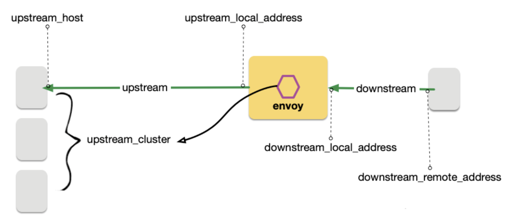

# 学习文档

## 基于权重的路由

设置路由的权重

灰度发布（金丝雀发布）、蓝绿部署、AB测试

与k8s基于部署的版本迁移的区别

## 可观测性

Grafana 可以对接多个数据源

### Envoy日志

Envoy日志的配置，放在istio里的configmap。

Envoy流量五元组：

* UPSTREAM_CLUSTER
* DOWNSTREAM_REMOTE_ADDRESS
* DOWNSTREAM_LOCAL_ADDRESS
* UPSTREAM_LOCAL_ADDRESS
* UPSTREAM_HOST

Envoy 接受请求流量叫做 Downstream，Envoy 发出请求流量叫做 Upstream。在处理 Downstream 和 Upstream 过程中， 分别会涉及 2 个流量端点，即请求的发起端和接收端。

在这个过程中， Envoy 会根据用户规则，计算出符合条件的转发目的主机集合，这个集合叫做 UPSTREAM_CLUSTER, 并根据负载均衡规则，从这个集合中选择一个 host 作为流量转发的接收端点，这个 host 就是 UPSTREAM_HOST。

