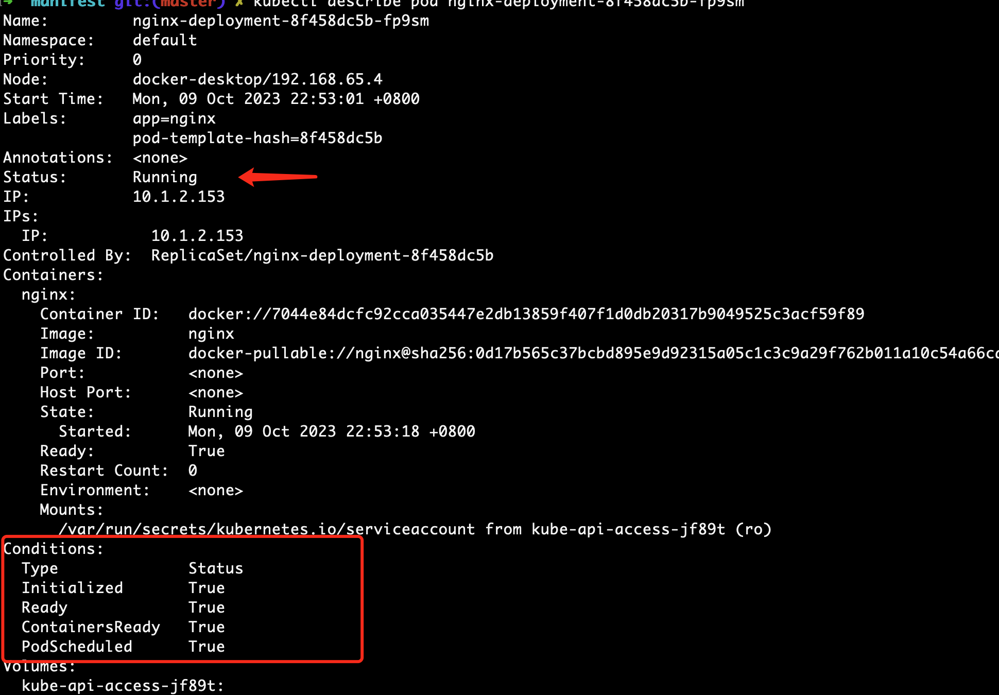

# Pod

Pod，是k8s项目中最小的API对象，是k8s项目的原子调度单元。

为什么需要Pod?

* 资源调度 相互协作的应用，必须部署在同一台机器上。调度器统一按照Pod而非容器的资源需求进行计算。
* 容器设计模式 sidecar

Swarm无法成长起来的重要原因：一旦到了真正的生产环境上，Swarm这种单容器的工作方式，难以描述真实世界里复杂的应用架构。

## Pod的实现原理

Pod是如何被创建出来的？

* **Pod，其实是一组共享了某些资源的容器。Pod里的所有容器，共享的是同一个Network Namespace，并且可以声明共享同一个Volume**。
* 在k8s项目里，Pod的实现需要使用一个中间容器，叫做infra容器。在这个Pod中，infra容器永远都是第一个被创建的容器，而其他用户定义的容器，则通过Join Network Namespace的方式，与infra容器关联在一起。


infra容器占用极少的资源，使用的是一个非常特殊的镜像，叫做k8s.gcr.io/pause。这个镜像是一个永远处于“暂停”状态的容器。

一个Pod只有一个IP地址，也就是这个Pod的Network Namespace对应的IP地址。

Pod的生命周期只跟infra容器一致，而与容器A和B无关。

## 容器设计模式

在Pod中，所有init Container定义的容器，都会比spec.containers定义的用户容器先启动。并且，init Container容器会顺序逐一启动，而知道他们都启动并且退出了，用户容器才会启动。

sidecar，指的是我们可以在一个Pod中，启动一个辅助容器，来完成一些独立于主容器之外的工作。

Pod扮演的是传统部署环境里的“虚拟机”的角色。

## 基本概念

几个重要字段的含义和用法：

* NodeSelector

```yaml
apiVersion: v1
kind: Pod
...
spec:
 nodeSelector:
   disktype: ssd
```

这个Pod只能运行在带有“disktype:ssd”标签的节点上。

* NodeName 一旦Pod被调度成功，NodeName会被调度器设置为对应节点名字。
* HostAliases 定义了Pod的hosts文件里的内容，如/etc/hosts

spec.containers相关字段

* ImagePullPolicy 镜像拉取策略
  * 默认为Always，即每次创建Pod都重新拉取一次镜像。
  * Never，Pod永远不会主动拉取这个镜像，只会使用本地镜像，本地如果没有，会报错，无法创建这个Pod
  * IfNotPresent 只在宿主机上不存在这个镜像时才拉取
* Lifecycle 定义容器状态发生变化时触发的hook，postStart/preStop

Pod对象的生命周期的变化，主要体现在Pod API对象的Status部分。其中pod.status.phrase，就是Pod的当前状态，它有以下几种可能的情况。

* Pending Pod的yaml文件提交给k8s，API对象已经被创建&保存在ETCD中。**我认为是 未调度**。
* Running 调度成功，跟一个具体节点绑定。容器至少有一个正在运行中。
* Succeeded Pod里的所有容器都正常运行完毕，并且已经退出了。
* Failed Pod里至少有一个容器以不正常的状态退出。
* Unknown 这是一个异常状态，意味着Pod的状态不能持续地被kubelet汇报给apisever，很可能是主从节点间的通信出现了问题。

Pod对象的Status字段，还可以再细分出一组Conditions。这些细分状态的值包括：PodScheduled、Ready、Initialized，以及 Unschedulable。



它们主要用于描述造成当前 Status 的具体原因是什么。比如，Pod 当前的 Status 是 Pending，对应的 Condition 是 Unschedulable，这就意味着它的调度出现了问题。

而其中，Ready 这个细分状态非常值得我们关注：它意味着 Pod 不仅已经正常启动（Running 状态），而且已经可以对外提供服务了。这两者之间（Running 和 Ready）是有区别的，你不妨仔细思考一下。

kubernetes/vendor/k8s.io/api/core/v1/types.go 有描述Pod对象，可以查阅。

## 进阶

Projected Volume：投射数据卷，为容器提供预先定义好的数据

* Secret
* ConfigMap
* Downward API
* ServiceAccountToken

### Secret

Secret作用，把Pod想要访问的加密数据，存放到Etcd中。然后就可以通过在Pod的容器里挂载Volume的方式，访问到这些Secret里保存的信息。

可以存放数据库用户名密码等信息。

```yaml
apiVersion: v1
kind: Secret
metadata:
  name: mysecret
type: Opaque
data:
  user: YWRtaW4=
  pass: MWYyZDFlMmU2N2Rm
```

data字段，保存的数据必须是经过Base64转码的，而并没有加密。在生产环境中，需要在k8s中开启secret的加密插件，增强数据的安全性。

```shell
# 进入Pod容器
kubectl exec -it test-pod-secret -- /bin/sh
```

进入容器，可以看到，保存在Etcd中的用户名和密码，已经以**文件的形式**出现子容器的volume目录中。一旦对应的Etcd里的数据被更新，这些Volume中的文件内容，同样也会被更新。其实，这是kubelet组件在定时维护这些Volume。（`<font color="red">`kubelet如何维护这些Volume??`</font>`）

需要注意的是，这个更新可能会有一定的延时。

### ConfigMap

它与Secret的区别在于，ConfigMap保存的是不需要加密的、应用所需的配置信息。

```yaml
apiVersion: v1
data: 
  ui.properties: | 
    color.good=purple 
    color.bad=yellow 
    allow.textmode=true 
    how.nice.to.look=fairlyNice  
kind: ConfigMap
metadata: 
  name: ui-config 
  ...
```

### Downward API

它的作用是，让Pod里的容器能够直接获取到这个Pod API对象本身的信息。

需要注意的是，Downward API能够获取到的信息，一定是Pod里的容器进程启动之前就能够确定下来的信息。而如果你想要获取Pod容器运行后才会出现的信息，比如，容器进程的PID，那就肯定不能使用Downward API了，而应该考虑在Pod里定一个一个sidecar容器。

### Service Account

Service Account对象的作用，就是k8s系统内置的一种“服务账户”，它是k8s进行权限分配的对象。比如 Service Account A，可以只被允许对k8s API进行GET操作。

Service Account的授权信息，实际上保存在它所绑定的一个特殊的Secret对象里。这个特殊的Secret，叫做ServiceAccountToken。

任何运行在k8s集群上的应用，都必须使用这个token里保存的授权信息，才可以合法访问API Server。

另外，为了方便使用，k8s已经为你提供了一个默认的“服务账户”（default Service Account）。并且，任何一个运行在k8s里的Pod，都可以直接使用这个默认的Service Account，而无需显示地声明挂载它。

这是如何做到的呢？k8s其实在每个Pod创建的时候，自动在它的spec.volumes部分添加上了磨人ServiceAccountToken的定义，然后自动给每个容器加上了对应的volumeMounts字段。

### 容器健康检查

健康检查探针（livenessProbe）

restartPolicy 容器恢复策略

* Always：在任何情况下，只要容器不在运行状态，就自动重启容器；
* OnFailure: 只在容器 异常时才自动重启容器；
* Never: 从来不重启容器。
* 只要 Pod 的 restartPolicy 指定的策略允许重启异常的容器（比如：Always），那么这个 Pod 就会保持 Running 状态，并进行容器重启。否则，Pod 就会进入 Failed 状态 。
* 对于包含多个容器的 Pod，只有它里面所有的容器都进入异常状态后，Pod 才会进入 Failed 状态。在此之前，Pod 都是 Running 状态。此时，Pod 的 READY 字段会显示正常容器的个数，

readnessProbe，决定这个Pod是不是能被通过Service的方式访问到。

### Pod预设置

PodPreset: 对Pod进行自动化修改的工具对象。

```yaml
apiVersion: settings.k8s.io/v1alpha1
kind: PodPreset
metadata:
  name: allow-database
spec:
  selector:
    matchLabels:
      role: frontend
  env:
    - name: DB_PORT
      value: "6379"
  volumeMounts:
    - mountPath: /cache
      name: cache-volume
  volumes:
    - name: cache-volume
      emptyDir: {}
```

## TODO

Pod 的另一个重要特性是，它的所有容器都共享同一个 Network Namespace。这就使得很多与 Pod 网络相关的配置和管理，也都可以交给 sidecar 完成，而完全无须干涉用户容器。这里最典型的例子莫过于 Istio 这个微服务治理项目了。如何做的？？？
