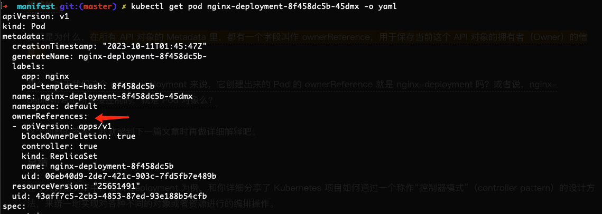
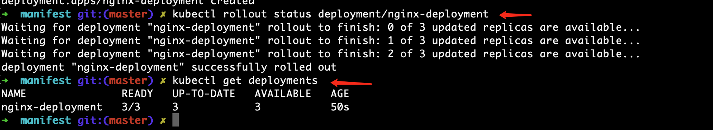

# 控制器

controller manager组件，就是一系列控制器的集合。可以查看k8s项目的 ``pkg/controller``目录。

这些控制器，都遵循k8s项目中一个通用编排模式，即：控制循环（control loop）。

```
for {
  实际状态 := 获取集群中对象X的实际状态（Actual State）
  期望状态 := 获取集群中对象X的期望状态（Desired State）
  if 实际状态 == 期望状态{
    什么都不做
  } else {
    执行编排动作，将实际状态调整为期望状态
  }
}
```

```yaml
apiVersion: apps/v1
kind: Deployment
metadata:
  name: nginx-deployment
spec:
  replicas: 1
  selector:
    matchLabels:
      app: nginx
  template:
    metadata:
      labels:
        app: nginx
    spec:
      containers:
        - name: nginx
          image: nginx
```



Kubernetes 使用的这个“控制器模式”，跟我们平常所说的“事件驱动”，有什么区别和联系吗？

如果操作失败比较难处理，但是控制器是循环一直在尝试的，更符合kubernetes申明式API，最终达到与申明一致

## Deployment

功能：水平扩展、伸缩、滚动升级

这个能力的实现，依赖于ReplicaSet。


其中，ReplicaSet负责，保证系统中Pod的个数永远等于指定的个数。这也正是Deployment只允许容器的restartPolicy=Always的主要原因：只有在容器能保证自己始终是Running状态的前提下，ReplicaSet调整Pod的个数才有意义。

Deployment，通过控制器模式，来操作ReplicaSet的个数和属性，进而实现“水平扩缩容”和“滚动更新”这两个编排动作。

### 滚动更新



在返回结果中，我们可以看到四个状态字段，它们的含义如下所示。

* DESIRED：用户期望的 Pod 副本个数（spec.replicas 的值）；
* CURRENT：当前处于 Running 状态的 Pod 的个数；
* UP-TO-DATE：当前处于最新版本的 Pod 的个数，所谓最新版本指的是 Pod 的 Spec 部分与 Deployment 里 Pod 模板里定义的完全一致
* AVAILABLE：当前已经可用的 Pod 的个数，即：既是 Running 状态，又是最新版本，并且已经处于 Ready（健康检查正确）状态的 Pod 的个数。可以看到，只有这个 AVAILABLE 字段，描述的才是用户所期望的最终状态。

实时查看Deployment对象的状态变化

```shell
kubectl rollout status deployment/nginx-deployment
```

提交一个Deployment对象后，Deployment Controller会立即创建一个ReplicaSet。这个ReplicaSet的名字，是由Deployment的名字和一个随机字符串共同组成。这个随机字符串叫做pod-template-hash。

滚动升级：在升级刚开始的时候，集群中只有一个新版本的Pod。如果这时，新版本Pod有问题启动不起来，那么“滚动更新”就会停止，从而允许开发和运维人员介入。


Deployment 对象有一个字段，叫作 spec.revisionHistoryLimit，就是 Kubernetes 为 Deployment 保留的“历史版本”个数。所以，如果把它设置为 0，你就再也不能做回滚操作了。

Deployment实际上是一个两层控制器。首先，它通过ReplicaSet的个数来描述应用的版本；然后，它再通过ReplicaSet的属性，来保证Pod的副本数量。

> Deployment控制ReplicaSet(版本)，ReplicaSet控制Pod副本数量。

有了 Deployment 的能力之后，你可以非常轻松地用它来实现金丝雀发布、蓝绿发布，以及 A/B 测试等很多应用发布模式。这些问题的答案都在这个 GitHub 库，https://github.com/ContainerSolutions/k8s-deployment-strategies/tree/master/canary
`<font color="red">`待实践`</font>`

## StatefulSet

StatefulSet控制器，使用Pod模板创建Pod的时候，对它们进行编号，并且按照编号顺序逐一完成创建工作。

这个编号会体现在Pod的名字和hostname等标识信息上，这不仅代表了Pod的创建顺序，也是Pod的重要网络标识。

与此同时，通过Headless Service的方式，为每个Pod创建了一个固定且稳定的DNS记录，来作为它的访问入口。

创建StatefulSet必须要先创建一个Headless Service。

Pod有了编码的网络标识后，StatefulSet就使用k8s里的两个标准功能：Headless Service和PV/PVC，实现了对Pod的拓扑状态和存储状态的维护。

## 声明式API

对于 kubectl create/replace 为命令式配置文件操作。

kubectl apply 为声明式API。

实际上，kubectl replace的执行过程，是使用新的yaml文件中的API对象，替换原有的API对象；

而 kubectl apply，则是执行了一个对原API对象的 PATCH 操作。

更进一步地，这意味着 apiserver 在响应命令式请求（如 kubectl replace）的时候，一次只能处理一个写请求，否则会有产生冲突的可能。

而对于声明式请求（如 kubectl apply），一次能处理多个写操作，并且具备Merge能力。

### Istio

Istio 项目，实际上就是一个基于 k8s 项目的微服务治理框架。


Istio 最根本的组件，是运行在每一个应用Pod里的 Envoy 容器。

Envoy 项目，是 Lyft 公司推出的一个高性能 C++ 网络代理。也是 Lyft 公司对 Istio 项目的唯一贡献。

Istio 项目，把 Envoy 这个代理服务以 sidecar 容器的方式，运行在了每一个被治理的应用 Pod 中。我们知道，Pod里的所有容器都共享同一个Network Namespace。

所以，Envoy容器就能够通过配置 Pod 里的 iptables 规格，把整个Pod的进出流量接管下来。

这时候，Istio 的控制层里的 Pilot 组件，就能够通过调用每个 Envoy 容器的API，对这个 Envoy 代理进行配置，从而实现微服务治理。


